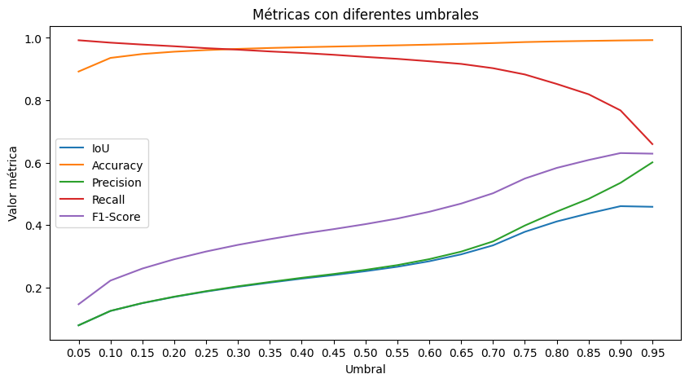

# Informe de Práctica 2: Segmentación OCT

| Correo | Nombre |
|----------|-------|
| i.moure@udc.es | Iván Moure Pérez |
| pablo.hernandez.martinez@udc.es | Pablo Hernández Martínez |

## Introducción

En esta práctica hemos desarrollado una serie de modelos para la segmentación semántica de imágenes de tomografía de coherencia óptica (OCT) utilizando la arquitectura *UNet*. El objetivo es identificar y segmentar regiones de fluido patológico en las imágenes, lo que es útil para el diagnóstico y seguimiento de enfermedades oculares.

## Desarrollo

En general, intentamos encapsular la mayoría de tareas en funciones independientes para no repetir los mismos bloques de código varias veces y facilitar el proceso de *debug*.

### Pasos previos

Para empezar a trabajar, nos básamos en el *notebook* provisto, que ya contiene clases para definir el dataset y la arquitectura de la red *UNet*. A continuación preparamos el *dataset* para el entrenamiento, asignando 40 imágenes al conjunto de entrenamiento, 5 al de validación y 5 al de test. Las imágenes se reescalan a una resolución de 416x624, y se crean los *dataloaders* con *batch size* de 8.

### Entrenamiento

Para entrenar los modelos creamos una función que recibe todos los parámetros necesarios (*dataloaders*, número de *epochs*, optimizador, etc.) y devuelve el modelo entrenado. Además, también muestra una gráfica con la evolución del *loss* de entrenamiento y validación. El modelo se guarda a disco, y nos quedamos con la versión con mejor *loss* de validación.

### Evaluación

Como la red *UNet* no tiene una capa sigmoide al final, utilizamos una función `get_binary_mask` para obtener la clase de salida. Esta función recibe las salidas (*logits*) del modelo, les aplica la sigmoide y las binariza según el umbral deseado.

Una vez entrenado el modelo, lo evalúamos con varios umbrales para decidir cual es el más adecuado. Se calculan las métricas *accuracy*, *precision*, *recall*, *IoU/Jaccard* y *F1/Dice*. Las métricas resultantes se muestran en formato tabla y gráfica. Esto nos permite, por ejemplo, elegir el umbral que equilibre mejor el *recall* y el *precision*. A mayores, también mostramos la curva *Precision-Recall* y el *average precision* para comparar el rendimiento de los modelos en cuanto a estas métricas.

    
    
 Figura 1: Ejemplo de curva <i>Precision-Recall</i> 

Por último, creamos una función que muestra por pantalla las predicciones (máscaras) de un modelo, para evaluar su rendimiento visualmente. Creemos que es importante mostrar el comportamiento real del modelo porque sería lo que verían los profesionales médicos al utilizar el sistema, y podríamos obtener *feedback* real sobre su precisión y fiabilidad.

    
    
 Figura 2: Ejemplo de predicción de un modelo 

<!-- SALTO DE PÁGINA -->

## Mejoras implementadas

### Ponderación de la clase positiva

El primer modelo que entrenamos predecía todos los píxeles como negros. Esto no es sorprendente: el desbalanceo entre clase negativa (negro) y positiva (blanco) es considerable, y el modelo aprendió que predecir siempre 0 minimizaba la función de *loss*.

En vez de cambiar a otro tipo de modelo que fuese más resiliente frente al desbalanceo como un árbol de decisión, modificamos los parámetros de la función de loss para darle 40 veces más peso a la clase positiva. Probamos con valores más bajos (<=30) pero no eran suficientes para compensar el desbalanceo y converger en una solución satisfactoria. Con valores más altos (>=50) el modelo era demasiado propenso a predecir la clase positiva (a veces incluso predecía todo como positivo).

Esta mejora se aplica a todas las funciones de *loss* que incluyan *Binary Cross Entropy*. Somos conscientes de que tendríamos que tunear este hiperparámetro si adaptásemos el sistema para tratar con otro tipo de imágenes médicas que tuviesen una distribución de clases diferente.

### *Data Augmentation*

Teniendo en cuenta que la cantidad de imágenes anotadas es escasa, probamos a utilizar *Data Augmentation* para introducir más variabilidad e intentar que los modelos generalizasen mejor. Las transformaciones por las que nos acabamos decantando fueron volteos horizontales (p=.1), rotaciones aleatorias (±5 grados) y variaciones de contraste (±10%). Inicialmente también empléabamos `RandomAffine`, pero comprobamos que era demasiado violenta y mermaba el rendimiento en la mayoría de ocasiones. A continuación, creamos un *dataloader* nuevo para poder pasar las imágenes transformadas a la función de entrenamiento.

### Funciones de *loss*

Después de entrenar el *baseline* con *BCE*, se nos ocurrió incorporar las métricas pertinentes en una tarea de segmentación semántica (*Dice*, *F1*, *Hausdorff*) a la función de loss. Tras investigar un poco descubrimos que es posible, pero normalmente combinándolas con *BCE* para facilitar el flujo de gradiente  y poder ponderar una de las clases (Azad, 2023). En estas funciones de *loss* combinadas, se añade un hiperparámetro *alpha* que nos permite ajustar la contribución de cada función al valor final:

> loss = (α)loss 1 + (1 - α)loss 2

Procedimos a crear subclases de `torch.nn.Module` para poder usar estas funciones de *loss* personalizadas en nuestro bucle de entrenamiento.

* *BCE + Dice*: para esta función, el *alpha* es 0.5 porque en nuestra experiencia los valores más bajos no convergen o tardan demasiado, y los valores más altos apenas mejoran el rendimiento del baseline
* *Jaccard/IoU*: para este loss no usamos *BCE* (*alpha*=0), porque no observamos ninguna dificultad con la convergencia durante el entrenamiento y además nos otorga el mejor rendimiento
* *BCE + Hausdorff*: aquí alpha es 0.999: puede parecer extremo, pero observamos que la *loss* de *Hausdorff* devuelve valores en una escala mucho mayor, así que es necesario para igualar la contribución y asegurar la convergencia

### *Decay* de la tasa de aprendizaje

Durante el entrenamiento, nos dimos cuenta de que la tasa de aprendizaje inicial podía ser demasiado alta, ya que en ocasiones el modelo convergía en valores mucho más altos que en otros entrenamientos. Para evitar esto, añadimos un *decay* de la tasa de aprendizaje (`ReduceLROnPlateau` de `torch.optim`), que divide el *learning rate* entre 10 cada vez que el *loss* de validación pasa 7 epochs sin mejorar significativamente. Esto nos permitió estabilizar el entrenamiento y obtener resultados más consistentes. Al principio la paciencia era de 5 epochs, pero decidimos aumentarla a 7 porque era muy fácil que el modelo ralentizase demasiado el aprendizaje y no convergiese.

## Hiperparámetros

| Loss            | Epochs | LR inicial | ¿LR Decay? | ¿Data Augmentation? | Umbral |
|-----------------|--------|------------|------------|---------------------|--------|
| BCE (baseline)  | 75     | 1e-4       | No         | No                  | 0.9    |
| BCE             | 90     | 1e-4       | Si         | Si                  | 0.9    |
| BCE + Dice      | 90     | 1e-4       | Si         | No                  | 0.8    |
| Jaccard         | 90     | 1e-4       | Si         | No                  | 0.4    |
| BCE + Hausdorff | 90     | 1e-4       | No         | No                  | 0.95   |

Para escoger el mejor umbral, buscamos el valor de *IoU* más alto en la tabla de resultados y en la gráfica (figura 3), que además equilibre *precision* y *recall* en la medida de lo posible. Para esta tarea concreta (OCT) creemos que *IoU* es la métrica más relevante porque el objetivo es encontrar exactamente las regiones de fluido patológico, y el desbalanceo entre clases hace que *precision* y *recall* no sean las métricas más adecuadas.

    
    
 Figura 3: Métricas de un modelo con diferentes umbrales 

<!-- SALTO DE PÁGINA -->

## Resultados

A continuación mostramos los resultados obtenidos con los diferentes modelos entrenados. En la tabla se muestran las métricas de *accuracy*, *precision*, *recall*, *IoU/Jaccard* y *F1/Dice* para cada umbral óptimo.

| Modelo        | IoU        | Dice       | Precision  | Recall     | Accuracy   |
|-------------- |----------- |----------- |----------- |----------- |----------- |
| baseline      | 0.4608     | 0.6309     | 0.5355     | **0.7676** | 0.9916     |
| DataAug       | **0.4859** | **0.6540** | 0.5768     | 0.7551     | 0.9925     |
| BCE+Dice      | 0.4471     | 0.6179     | 0.56       | 0.6893     | 0.9920     |
| Jaccard       | 0.4310     | 0.6024     | **0.7210** | 0.5173     | **0.9936** |
| BCE+Hausdorff | 0.3845     | 0.5554     | 0.5288     | 0.5848     | 0.9913     |

Si nos basamos en *IoU* y *Dice*, el modelo que mejor rinde es el que emplea *Data Augmentation*, y el segundo es el *baseline*. Tiene sentido que el *Data Augmentation* ayude al modelo a generalizar. En el *dataset* hay imágenes que se han tomado con distintos dispositivos y a distintas resoluciones, y simular transformaciones similares le permite rendir mejor en test.

A lo largo de nuestras pruebas observamos resultados muy variados, porque las 5 imágenes que se eligen para test pueden influir significativamente en la evaluación de los modelos. En alguna ocasión afortunada llegamos a tener 0.65-0.75 de *IoU* en varios modelos, pero no creemos que evaluar con las instancias fáciles sea representativo. Los valores actuales representan bastante bien el rendimiento promedio, aunque el modelo de *Jaccard* suele obtener resultados mejores.

<!-- SALTO DE PÁGINA -->

## Mejoras posibles

En primer lugar, creemos que sería útil evaluar los modelos haciendo 5 o 10-*fold Cross Validation*, dada la reducida cantidad de imágenes del *dataset*. Además aliviaría el impacto de escoger un conjunto de test fácil o difícil. También hemos de tener en cuenta que esto ralentizaría bastante el desarrollo.

Por otro lado, podríamos intentar generar imágenes sintéticas para contribuir al entrenamiento, aunque esto requeriría un modelo *Autoencoder* bien entrenado, y probablemente un profesional que verificase la validez de las nuevas imágenes ficticias.

A mayores podríamos intentar retocar la arquitectura de *UNet*, cambiar de modelo o buscar una red preentrenada en una tarea de semgentación semántica aplicada a medicina similar (como *DUCK-Net*, desarrollada en Dumitru R. 2023). Aplicar *transfer learning* en esta tarea podría darnos resultados muy interesantes, aunque podría conllevar un tiempo considerable de entrenamiento y gastaría más recursos computacionales.

## Conclusiones

En conclusión, hemos conseguido entrenar un modelo de segmentación semántica para imágenes de OCT con resultados bastante satisfactorios. A pesar de la escasez de datos anotados, logramos mejorar el rendimiento del modelo base mediante técnicas como *Data Augmentation* y la ponderación de clases. Además, exploramos diferentes funciones de *loss* y ajustamos hiperparámetros para optimizar el proceso de entrenamiento.

## Referencias

* Azad, R., Heidary, M., Yilmaz, K., Hüttemann, M., Karimijafarbigloo, S., Wu, Y., ... & Merhof, D. (2023). Loss functions in the era of semantic segmentation: A survey and outlook. arXiv preprint arXiv:2312.05391.
* Dumitru, R. G., Peteleaza, D., & Craciun, C. (2023). Using DUCK-Net for polyp image segmentation. Scientific reports, 13(1), 9803.
